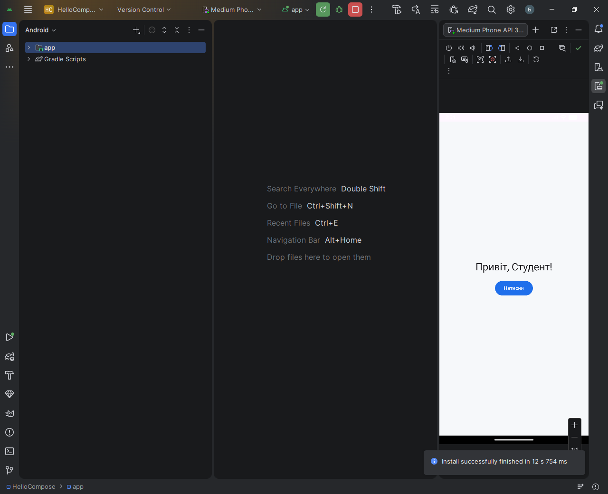
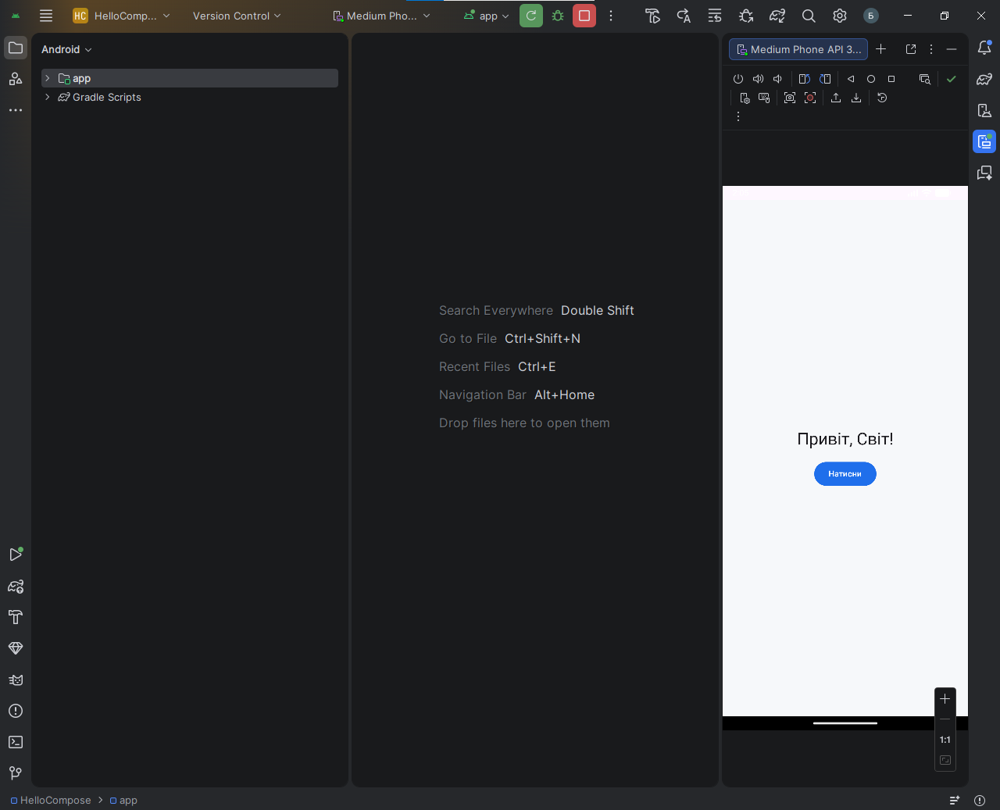

# Hello Compose


Навчальний Android-проєкт на Jetpack Compose для лабораторної роботи №1.

## Репозиторій

GitHub: `https://github.com/GO00D2121/hello-compose`

## Мета роботи

- встановити Android Studio та Android SDK
- створити застосунок `HelloCompose`
- налаштувати GitFlow
- додати Issue Templates, Pull Request Template та CI

## Технології

- Kotlin
- Jetpack Compose
- Material 3
- Gradle Kotlin DSL
- GitHub Actions

## Як запустити

1. Відкрийте папку `HelloCompose` в Android Studio.
2. Дочекайтесь `Gradle Sync`.
3. Перевірте, що для Gradle вибрано `JDK 17`.
4. Запустіть емулятор або підключіть телефон.
5. Натисніть `Run`.

## Поведінка застосунку

- на екрані показується текст `Привіт, Студент!`
- після натискання кнопки текст змінюється на `Привіт, Світ!`

## Скріншоти

Додайте 2 скріншоти перед здачею:

### Початковий екран



### Після натискання кнопки



## GitFlow

Робочі гілки:

- `main`
- `develop`
- `feature/hello-compose`

Приклад сценарію:

```bash
git checkout -b develop
git checkout -b feature/hello-compose develop
git checkout develop
git merge --no-ff feature/hello-compose
```

## CI

Workflow: `.github/workflows/android-ci.yml`

Він запускає:

- `assembleDebug`
- `test`
- `lint`

## Структура проєкту

```text
HelloCompose/
├── app/
├── .github/
├── docs/
├── gradle/
├── build.gradle.kts
├── settings.gradle.kts
├── gradle.properties
├── gradlew
└── gradlew.bat
```

## Що потрібно здати

1. Посилання на GitHub-репозиторій.
2. Посилання на README.
3. Скріншот запущеного застосунку.
4. Скріншот зеленого GitHub Actions.
5. Скріншот або посилання, де видно гілки `main`, `develop`, `feature/hello-compose`.
6. Посилання на один `Issue`.
7. Посилання на один `Pull Request` з `feature/hello-compose` у `develop`.

## Чеклист

- [ ] Проєкт відкривається в Android Studio без помилок
- [ ] Застосунок запускається на емуляторі або телефоні
- [ ] Репозиторій завантажено на GitHub
- [ ] Створені гілки `main`, `develop`, `feature/hello-compose`
- [ ] Створено щонайменше один `Issue`
- [ ] Створено щонайменше один `Pull Request`
- [ ] GitHub Actions проходить успішно
- [ ] У README додані реальні скріншоти
Оновлено у feature-ветці для лабораторної роботи.
